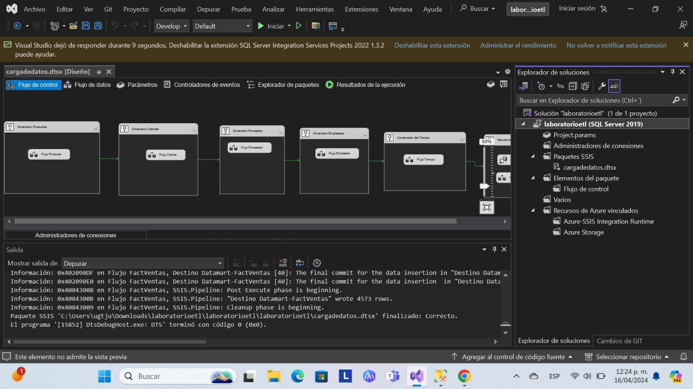

# ***Actividad de Evaluación. Proyecto etl y documentación md***
## Integrantes:
### Diana Guadalupe Viveros Migueles
### Aarón Yosef Chávez Martínez 
### Brisa Adriana Mendoza Vigueras

# Documentación
## Creación de la Base de Datos´
``` sql
create database datamartventas;
use datamartventas;
--hacer la primera dimension de estrella
--a dim  productos se le va a poner skproductio () y bkproducto (business key es el id del producto)
 drop table Employees;
CREATE TABLE [dbo].[DimProducts](
	skProductoId int not null identity(1,1) primary key,
	[ProductID] [int]  NOT NULL,
	[ProductName] [varchar](40) NULL,
	[categoryname] nvarchar(15) not null,
	[UnitinStock] [smallint] NULL,
)
go

CREATE TABLE [dbo].[DimEmployees](
	SkEmployeeId int not null identity(1,1) primary key,
	[EmployeeID] [int]  NOT NULL,
	FullName nvarchar(50) not null,
	[Address] [nvarchar](60) NULL,
	[City] [nvarchar](15) NULL,
	[Region] [nvarchar](15) NULL,
	[Country] [nvarchar](15) NULL
	)

CREATE TABLE [dbo].[DimCliente](
	SkCustomerId int not null identity(1,1) primary key,
	[CustomerID] [nchar](5) NOT NULL,
	[CompanyName] [nvarchar](40) NOT NULL,
	[Address] [nvarchar](60) NULL,
	[City] [nvarchar](15) NULL,
	[Region] [nvarchar](15) NULL,
	[Country] [nvarchar](15) NULL,
	)

CREATE TABLE [dbo].[DimProveedor](
	SkSupplierId int not null identity(1,1) primary key,
	[SupplierID] [int] NOT NULL,
	[CompanyName] [nvarchar](40) NOT NULL,
	[Address] [nvarchar](60) NULL,
	[City] [nvarchar](15) NULL,
	[Region] [nvarchar](15) NULL,
	[Country] [nvarchar](15) NULL,
	)

CREATE TABLE [dbo].[DimTiempo](
	SkTimeId int not null identity(1,1) primary key,
	TimeFecha date not null,
	TimeAño int not null,
	TimeTrimestre int not null,
	TimeMes int not null,
	TimeDescripcionMes nvarchar(20) not null,
	TimeDescripcionTrimestre nvarchar(20) not null,
	)

CREATE TABLE  factVentas(
sk_Cliente int not null,
sk_Proveedor int not null,
sk_Producto int not null,
sk_Empleado int not null,
sk_timeid int not null,
precioVenta money not null,
cantidadUnidades int not null,
importe money not null

constraint pk_fact_ventas primary key(sk_Cliente,sk_Proveedor,sk_Producto,sk_Empleado,sk_TimeId),
constraint fk_fact_cliente foreign key (sk_Cliente) references DimCliente,
constraint fk_fact_proveedor foreign key (sk_Proveedor) references DimProveedor,
constraint fk_fact_producto foreign key (sk_Producto) references DimProducts,
constraint fk_fact_empleado foreign key (sk_Empleado) references DimEmployees,
constraint fk_fact_timeid foreign key (sk_TimeId) references DimTiempo,
);
```
## Visualización del Diagrama
; 

# Llenar el Datawarehouse con un ETL 

## Arquitectura del flujo de control
; 

### Arquitectura de flujo de datos en Products

#### Orígenes 

#### Destino

